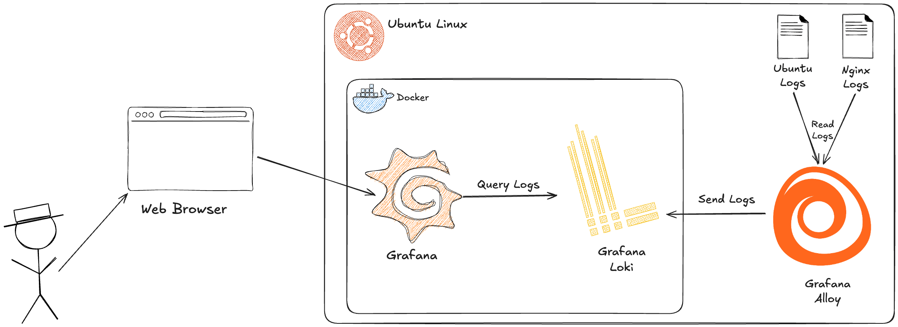

## Arquitectura

En este escenario construiremos una solución básica de observabilidad enfocada en logs utilizando **Grafana, Grafana Loki, Grafana Alloy y NGINX**.

A alto nivel, la arquitectura estará compuesta por los siguientes componentes:

* **Ubuntu Linux:** servidor donde se ejecutará nuestro entorno de observabilidad.
* **Docker:** utilizado para ejecutar Grafana y Loki.
* **Grafana:** herramienta utilizada para consultar y visualizar los logs mediante Grafana Explore.
* **Grafana Loki:** sistema de almacenamiento y consulta de logs.
* **Grafana Alloy:** componente encargado de recopilar los logs del servidor Ubuntu y enviarlos a Loki.
* **NGINX:** servidor web utilizado para generar logs de acceso y errores.
* **Web Browser:** utilizado para acceder a la interfaz de Grafana.

### Flujo de observabilidad

El flujo de datos entre los componentes será el siguiente:

1. **NGINX** se ejecuta en el servidor Ubuntu y genera logs de acceso y errores en archivos como `access.log` y `error.log`.

2. **Ubuntu Linux** también genera diferentes logs del sistema, que son almacenados en archivos dentro de `/var/log`.

3. **Grafana Alloy** utiliza el componente `filelog` para leer los logs generados por NGINX y por el sistema operativo.

4. **Grafana Alloy** procesa los logs y los envía a **Loki**.

5. **Grafana Loki** recibe y almacena los logs, permitiendo posteriormente realizar consultas sobre ellos mediante **LogQL**.

6. **Grafana** se configura con Loki como **data source** y consulta los logs almacenados utilizando **LogQL**.

7. El usuario accede a **Grafana desde un navegador web** para explorar y analizar los logs.

En resumen, el flujo principal de los logs es:

**Ubuntu / NGINX → Grafana Alloy → Loki → Grafana → Web Browser**

> **Nota:** Aunque Grafana utiliza Loki como *data source*, el *data source* es una configuración dentro de Grafana que define cómo conectarse a Loki. No representa un componente adicional dentro de la arquitectura.