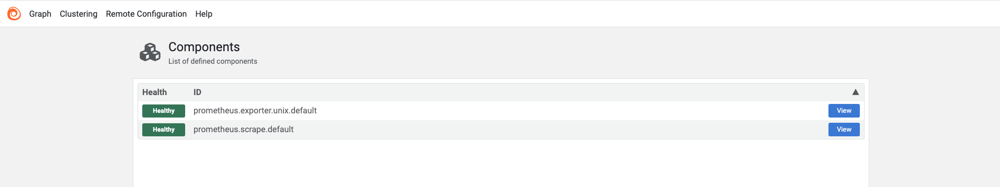

# Paso 1: Instalar Grafana Alloy

Antes de comenzar a recopilar nuestros logs, necesitamos instalar **Grafana Alloy** en nuestro servidor Ubuntu.

Alloy será el componente encargado de leer los archivos de logs que generaremos durante el escenario, procesarlos y posteriormente enviarlos a nuestro backend de logs, **Grafana Loki**.

## 1. Instalar GPG

Comenzaremos asegurándonos de que **GPG** esté instalado en nuestro servidor.

GPG nos permitirá verificar las firmas digitales utilizadas por el repositorio de Grafana y comprobar que los paquetes que instalaremos provienen de una fuente confiable.

Ejecuta el siguiente comando:

```bash
sudo apt-get install gpg -y
```{{exec}}

## 2. Agregar el repositorio de Grafana

A continuación, agregaremos el repositorio oficial de Grafana a los repositorios de nuestro servidor.

Primero crearemos el directorio donde almacenaremos la clave utilizada para verificar los paquetes:

```bash
sudo mkdir -p /etc/apt/keyrings
```{{exec}}

Ahora descargaremos la clave GPG del repositorio de Grafana:

```bash
sudo wget -O /etc/apt/keyrings/grafana.asc https://apt.grafana.com/gpg-full.key
```{{exec}}

Asignaremos los permisos necesarios para que APT pueda utilizar la clave:

```bash
sudo chmod 644 /etc/apt/keyrings/grafana.asc
```{{exec}}

Finalmente, agregaremos el repositorio de Grafana:

```bash
echo "deb [signed-by=/etc/apt/keyrings/grafana.asc] https://apt.grafana.com stable main" | sudo tee /etc/apt/sources.list.d/grafana.list
```{{exec}}

## 3. Actualizar los repositorios

Ahora que hemos agregado el repositorio de Grafana, debemos actualizar la información de los paquetes disponibles:
```bash
sudo apt-get update
```{{exec}}

## 4. Instalar Grafana Alloy

Con el repositorio configurado, podemos instalar Grafana Alloy:
```bash
sudo apt-get install alloy
```{{exec}}

Al instalar Alloy mediante el paquete de Ubuntu, se configura automáticamente como un servicio de systemd.

## 5. Configurar el acceso a la interfaz de Alloy

Por defecto, la interfaz HTTP de Alloy escucha en `127.0.0.1:12345`, lo que significa que solamente puede accederse desde el propio servidor.

Como estamos trabajando en un entorno de **Killercoda**, necesitamos permitir que la interfaz pueda ser accesible desde fuera del servidor.

Para ello, agregaremos el siguiente parámetro a la configuración del servicio: `--server.http.listen-addr=0.0.0.0:12345`

Este parámetro indica a Alloy que escuche en el puerto `12345` en todas las interfaces de red.

Ejecutaremos el siguiente comando para configurar este parámetro:

```bash
sed -i 's/CUSTOM_ARGS=""/CUSTOM_ARGS="--server.http.listen-addr=0.0.0.0:12345"/g' /etc/default/alloy
```{{exec}}

> **Nota:** No estamos modificando la configuración de Alloy que utilizaremos para recopilar logs. Estamos configurando un parámetro del servicio que determina en qué dirección de red estará disponible su interfaz HTTP.

## 6. Habilitar e iniciar Alloy

Ahora podemos habilitar Alloy para que se inicie automáticamente y, al mismo tiempo, iniciar el servicio:
```bash
sudo systemctl enable --now alloy
```{{exec}}

## 7. Comprobar el estado del servicio

Comprobemos que Alloy se está ejecutando correctamente:
```bash
sudo systemctl status alloy --no-pager
```{{exec}}

Deberíamos ver un estado similar a:
```bash
Active: active (running)
```

También podemos comprobar que Alloy está listo utilizando su endpoint de health check:

```bash
curl http://localhost:12345/-/ready
```{{exec}}

Si todo funciona correctamente, veremos:

```bash
Alloy is ready.
```

## 8. Acceder a la interfaz de Grafana Alloy

Finalmente, podemos acceder a la interfaz web de Alloy:

[Grafana Alloy Dashboard]({{TRAFFIC_HOST1_12345}})

Desde esta interfaz podremos consultar información sobre el estado de Alloy y, más adelante, comprobar los componentes que utilizaremos para recopilar nuestros logs.



## Resumen

En este paso hemos:

- Instalado **Grafana Alloy** en nuestro servidor Ubuntu.
- Agregado el repositorio oficial de Grafana.
- Configurado Alloy para que su interfaz HTTP sea accesible desde Killercoda.
- Habilitado e iniciado el servicio de Alloy.
- Comprobado que Alloy se encuentra funcionando correctamente.

En el siguiente paso utilizaremos **Docker** para instalar **Grafana** y **Grafana Loki**, que serán los componentes que utilizaremos para almacenar, consultar y visualizar nuestros logs.
