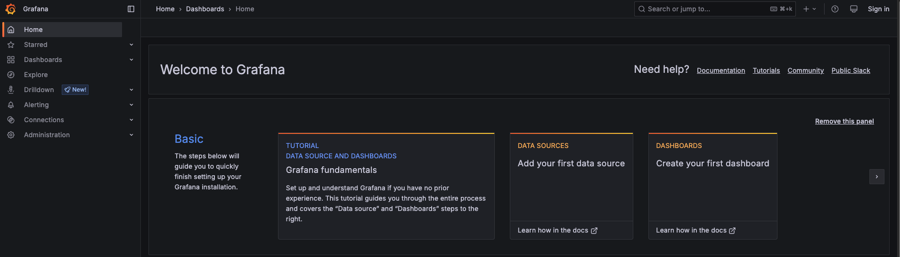

# Paso 2: Desplegar Grafana y Grafana Loki

En el paso anterior instalamos **Grafana Alloy**, que se está ejecutando directamente en nuestro servidor Ubuntu, y pudimos acceder a su interfaz web a través del puerto `12345`.

Ahora utilizaremos **Docker** para desplegar **Grafana Loki** y **Grafana** en nuestro servidor.

## Grafana Loki

**Grafana Loki** es un sistema de agregación de logs diseñado para almacenar y consultar los logs de aplicaciones e infraestructura.

En nuestro escenario, Grafana Loki almacenará los logs enviados por **Grafana Alloy**:

```text
Grafana Alloy → Grafana Loki
````

### 1. Iniciar Grafana Loki

El servicio de Loki ya está definido en nuestro archivo `docker-compose.yml`.

Primero, accederemos al directorio del proyecto:

```bash
cd ~/alloy-loki-observability
```{{exec}}

Podemos revisar que el servicio `loki` está definido en el archivo:

```bash
sed -n '1,8p;9q' docker-compose.yml
```{{exec}}

El servicio de Grafana Loki estará disponible en el puerto `3100` del servidor.

Utilizaremos la imagen oficial de Grafana Loki:

```yaml
loki:
  image: grafana/loki:3.0.0
```

Para iniciar Grafana Loki, ejecutaremos:

```bash
docker-compose up -d loki
```{{exec}}

Podemos comprobar que el contenedor está ejecutándose:

```bash
docker-compose ps
```{{exec}}

Deberías ver el contenedor `loki` con un estado similar a:

```text
NAME    STATUS
loki    Up
```

También podemos consultar los últimos logs del contenedor:

```bash
docker-compose logs --tail=50 loki
```{{exec}}

Finalmente, podemos comprobar que Loki está listo utilizando su endpoint de health check:

```bash
curl http://localhost:3100/ready
```{{exec}}

Si todo funciona correctamente, veremos:

```text
ready
```

## Grafana

**Grafana** será la herramienta que utilizaremos para consultar y visualizar los logs almacenados en Grafana Loki.

En este paso nos concentraremos únicamente en iniciar Grafana y verificar que podemos acceder a su interfaz web.

En el siguiente paso configuraremos **Grafana Loki como data source de Grafana**.

### 2. Iniciar Grafana

El servicio de Grafana ya está definido en nuestro archivo `docker-compose.yml`.

Podemos revisar que el servicio `grafana` está definido en el archivo:

```bash
sed -n '1,1p;10,24p;25q' docker-compose.yml
```{{exec}}

El servicio utiliza la imagen oficial de Grafana:

```yaml
grafana:
  image: grafana/grafana:11.6
```

Grafana estará disponible en el puerto `3000` del servidor.

Para iniciar Grafana, ejecutaremos:

```bash
docker-compose up -d grafana
```{{exec}}

> **Nota:** Grafana puede tardar unos momentos en iniciar completamente después de ejecutar el comando anterior. **Espera un par de minutos antes de acceder a la interfaz web.** Si intentas acceder inmediatamente, es posible que inicialmente aparezca un error mientras el servidor termina de iniciar.

Podemos comprobar que los contenedores están ejecutándose:

```bash
docker-compose ps
```{{exec}}

Deberías ver los servicios `loki` y `grafana` con un estado similar a:

```text
NAME      STATUS
loki      Up
grafana   Up
```

### 3. Acceder a Grafana

Grafana está disponible en el puerto `3000`.

Puedes acceder a la interfaz web utilizando el siguiente enlace:

[Grafana]({{TRAFFIC_HOST1_3000}})



En este escenario no será necesario introducir credenciales para acceder a Grafana. El entorno está configurado para permitir el acceso anónimo con permisos de administrador.

Una vez dentro de Grafana, deberías poder visualizar la página principal de la aplicación.

## Resumen

En este paso hemos:

* Desplegado **Grafana Loki** utilizando Docker Compose.
* Desplegado **Grafana** utilizando Docker Compose.
* Comprobado que Grafana Loki se encuentra disponible.
* Accedido a la interfaz web de Grafana.

En el siguiente paso continuaremos preparando nuestro servidor Ubuntu. **Instalaremos NGINX**, que utilizaremos para generar logs de acceso y errores.

También configuraremos **Grafana Loki como data source en Grafana**, para que podamos consultar posteriormente los logs recopilados por Grafana Alloy.
