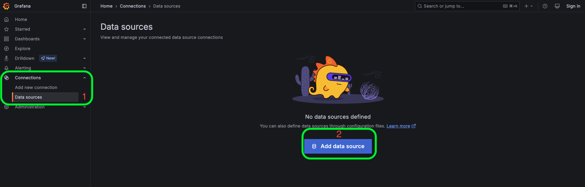
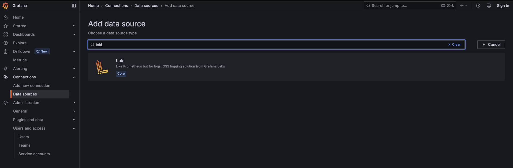
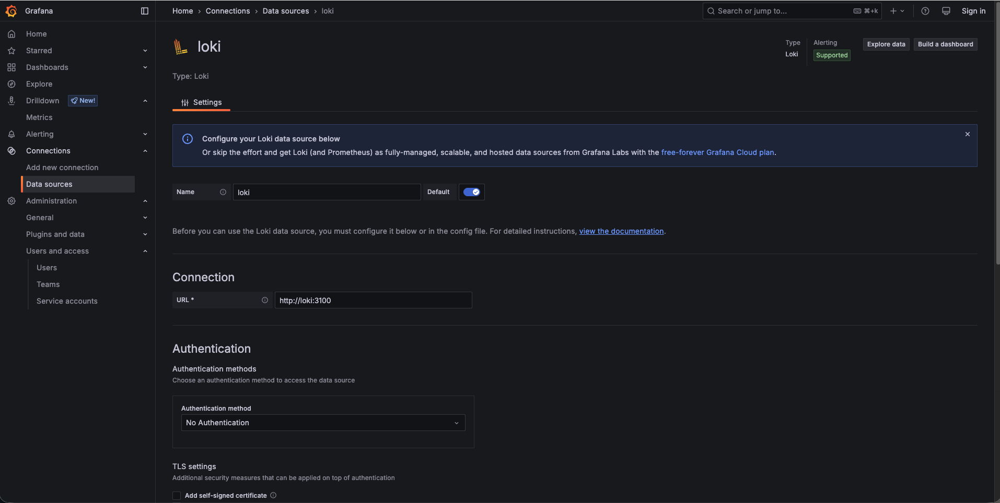
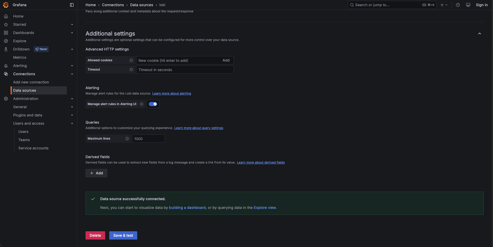
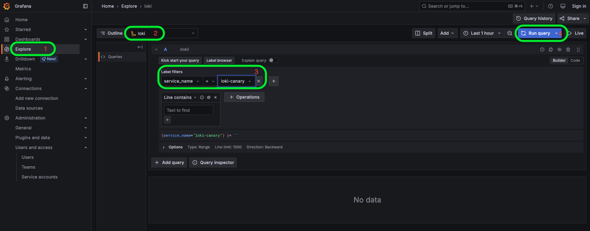
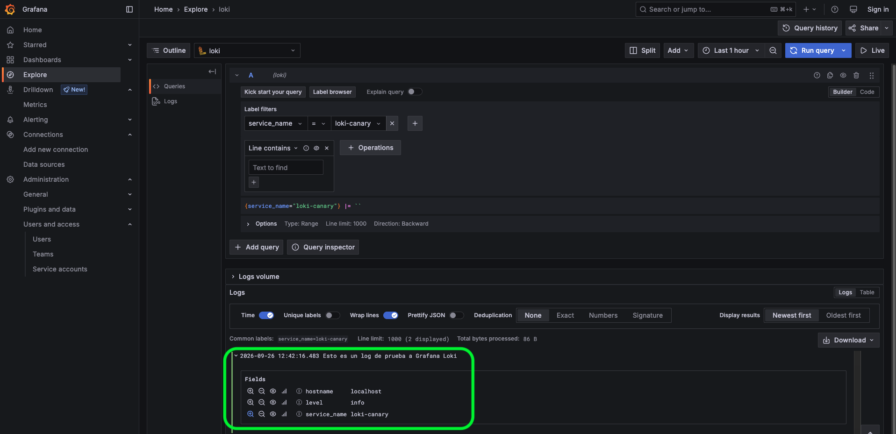

# Paso 3: Instalar NGINX y configurar Loki en Grafana

En el paso anterior desplegamos **Grafana** y **Grafana Loki** utilizando Docker.

Ahora prepararemos nuestro servidor Ubuntu para generar logs que posteriormente recopilaremos con Grafana Alloy.

Para ello, primero instalaremos **NGINX** y comprobaremos que está funcionando correctamente. Después configuraremos **Grafana Loki como data source de Grafana** y enviaremos un log de prueba para verificar que Grafana puede consultar los datos almacenados en Loki.

## NGINX

### ¿Qué es NGINX?

**[NGINX](https://nginx.org/)** es un servidor web y proxy inverso de alto rendimiento. Es software libre y de código abierto, y es ampliamente utilizado para servir contenido web y gestionar tráfico HTTP.

En este escenario utilizaremos NGINX principalmente porque genera **logs de acceso y errores** que posteriormente podremos recopilar con Grafana Alloy.

### 1. Instalar NGINX

Instalaremos NGINX directamente en nuestro servidor utilizando los paquetes disponibles para Ubuntu:

```bash
sudo apt-get install nginx -y
```{{exec}}

### 2. Verificar la instalación

Primero podemos comprobar la versión de NGINX instalada:

```bash
nginx -v
```{{exec}}

Ahora comprobaremos que el servicio se encuentra ejecutándose correctamente:

```bash
sudo systemctl status nginx --no-pager
```{{exec}}

Deberíamos ver un estado similar a:

```text
Active: active (running)
```

### 3. Acceder a la página de inicio de NGINX

Finalmente, podemos comprobar que NGINX está funcionando accediendo a su página de bienvenida:

[Página de inicio de NGINX]({{TRAFFIC_HOST1_80}})

Si todo funciona correctamente, veremos la página de bienvenida de NGINX.

Al acceder a esta página también estaremos generando nuestro primer registro en el archivo de logs de acceso de NGINX.

## Configurar Loki en Grafana

Ahora que tenemos NGINX funcionando, vamos a configurar la conexión entre **Grafana y Grafana Loki**.

### 1. ¿Qué es un data source?

Grafana puede obtener información desde diferentes fuentes de datos, como bases de datos, sistemas de monitorización y sistemas de almacenamiento de logs.

Estas fuentes de datos se configuran en Grafana como **data sources**.

En nuestro escenario utilizaremos **Grafana Loki como data source**:

```text
Grafana Alloy
      │
      │ send logs
      ▼
  Grafana Loki
      ▲
      │
      │ query
      │
   Grafana
```

**Grafana Loki** se encarga de almacenar y consultar los logs, mientras que **Grafana** se conecta a Loki para consultar y visualizar esos logs.

> **Nota:** En este momento todavía no hemos configurado Alloy para enviar nuestros logs a Loki. Primero vamos a comprobar que la comunicación entre Grafana y Loki funciona correctamente.

### 2. Agregar Grafana Loki como data source

Desde la interfaz de Grafana, abre el menú de configuración y selecciona:

**Connections → Data sources**

Haz clic en:

**Add new data source**



Selecciona:

**Loki**



Ahora debemos indicar a Grafana dónde puede encontrar nuestro servidor de Loki.

Como **Grafana y Loki se ejecutan dentro del mismo entorno Docker Compose**, podemos utilizar el nombre del servicio `loki` como hostname.

En el campo **Connection → URL**, introduce:

```text
http://loki:3100
```{{copy}}

La configuración debería quedar similar a:



> **Importante:** Aquí no utilizamos `localhost:3100`. Desde el contenedor de Grafana, `localhost` hace referencia al propio contenedor de Grafana. Utilizamos `loki` porque corresponde al nombre del servicio definido en Docker Compose. Docker permite que los servicios de un mismo entorno se comuniquen utilizando sus nombres de servicio.

No es necesario modificar las demás opciones para este escenario.

Haz clic en:

**Save & test**



### 3. Verificar la conexión

Si la configuración es correcta, Grafana debería mostrar un mensaje indicando que el data source está funcionando correctamente.

Esto confirma que Grafana puede comunicarse con Loki utilizando:

```text
Grafana → http://loki:3100 → Loki
```

Ahora Grafana está preparado para consultar los logs almacenados en Loki.

### 4. Enviar un log de prueba a Loki

Antes de configurar Grafana Alloy, vamos a enviar manualmente un log de prueba a Loki.

Esto nos permitirá comprobar que todo el flujo entre **Loki y Grafana** funciona correctamente antes de continuar.

Ejecuta el siguiente comando:

```bash
curl -v -H "Content-Type: application/json" -XPOST -s "http://localhost:3100/loki/api/v1/push" --data-raw \
"{\"streams\": [{ \"stream\": { \"service_name\": \"loki-canary\", \"level\": \"info\", \"hostname\": \"localhost\" }, \"values\": [ [ \"$(date +%s%N)\", \"Esto es un log de prueba a Grafana Loki\" ] ] }]}"
```{{exec}}

El comando anterior envía directamente un log a la API de Loki. Para este laboratorio no necesitamos profundizar todavía en el formato de la petición; lo importante es que estamos generando un dato que posteriormente podremos consultar desde Grafana.

### 5. Consultar el log desde Grafana

Ahora vamos a comprobar que el log que acabamos de enviar puede visualizarse desde Grafana.

Para ello utilizaremos **Explore**, una herramienta de Grafana que permite consultar y analizar datos directamente desde un data source.

1. Desde el menú lateral de Grafana, selecciona **Explore**.

2. En la parte superior de la pantalla, selecciona el data source **Loki**.

3. En la sección **Label filters**, selecciona:

   `service_name = loki-canary`

4. En la parte superior derecha, haz clic en **Run query**.



Deberíamos poder visualizar el log que enviamos anteriormente:



Esto confirma que **Grafana puede consultar correctamente los logs almacenados en Loki**.

## Resumen

En este paso hemos:

* Instalado **NGINX** en nuestro servidor Ubuntu.
* Comprobado que NGINX se encuentra funcionando correctamente.
* Configurado **Grafana Loki como data source** en Grafana.
* Verificado que Grafana puede comunicarse correctamente con Loki.
* Enviado un log de prueba directamente a Loki.
* Consultado el log desde **Grafana Explore**.

En este punto ya tenemos funcionando el backend y la herramienta de visualización:

```text
             Grafana Loki
                  ▲
                  │
                  │ query
                  │
               Grafana
                  ▲
                  │
                  │
             Web Browser
```

En el siguiente paso configuraremos **Grafana Alloy** para que pueda leer los archivos de logs de **NGINX y del sistema Ubuntu** y enviarlos automáticamente a Grafana Loki.