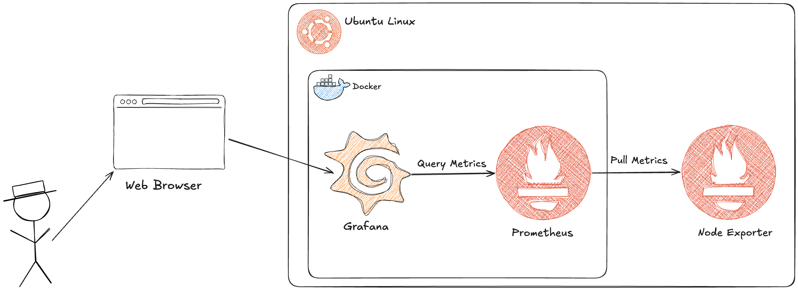

## Arquitectura

En este escenario construiremos una solución básica de monitorización utilizando **Grafana, Prometheus y Node Exporter**.

A alto nivel, la arquitectura estará compuesta por los siguientes componentes:

* **Ubuntu Linux:** servidor donde se ejecutará nuestro entorno de monitorización.
* **Docker:** utilizado para ejecutar Grafana y Prometheus.
* **Grafana:** herramienta utilizada para consultar y visualizar las métricas mediante dashboards.
* **Prometheus:** sistema de monitorización encargado de recopilar y almacenar las métricas.
* **Node Exporter:** componente que expone las métricas del sistema operativo, como CPU, memoria, disco y red.
* **Web Browser:** utilizado para acceder a la interfaz de Grafana.

### Flujo de monitorización

El flujo de datos entre los componentes será el siguiente:

1. **Node Exporter** se ejecuta en el servidor Ubuntu y expone las métricas del sistema a través de un endpoint HTTP.
2. **Prometheus** realiza periódicamente un *pull* (*scrape*) de las métricas expuestas por Node Exporter y las almacena en su base de datos de series temporales.
3. **Grafana** se configura con Prometheus como **data source** y consulta las métricas almacenadas utilizando **PromQL**.
4. El usuario accede a **Grafana desde un navegador web** para visualizar las métricas mediante dashboards.

En resumen, el flujo principal de las métricas es:

**Node Exporter → Prometheus → Grafana → Web Browser**

> **Nota:** Aunque Grafana utiliza Prometheus como *data source*, el *data source* es una configuración dentro de Grafana que define cómo conectarse a Prometheus. No representa un componente adicional dentro de la arquitectura.
