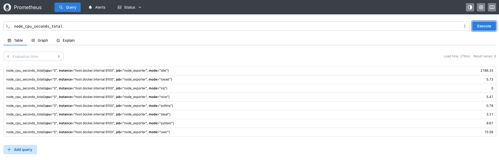

# Paso 2: Instalar y configurar Prometheus

En el paso anterior instalamos **Node Exporter**, que está ejecutándose directamente en nuestro servidor Ubuntu y exponiendo las métricas del sistema en el puerto `9100`.

Ahora utilizaremos **Prometheus** para recopilar y almacenar estas métricas.

## ¿Qué es Prometheus?

**Prometheus** es un sistema de monitorización y una base de datos de series temporales diseñado para recopilar y almacenar métricas.

Prometheus utiliza un modelo de *pull*, lo que significa que periódicamente consulta los endpoints de los componentes que queremos monitorizar y obtiene las métricas disponibles.

En nuestro escenario, Prometheus realizará un *scrape* de Node Exporter:

```text
Prometheus → Node Exporter
```

Node Exporter expone las métricas a través de:

```text
http://<host>:9100/metrics
```

Prometheus consultará este endpoint periódicamente y almacenará las métricas.

## Prometheus y Docker

En este escenario ejecutaremos **Prometheus dentro de un contenedor Docker** utilizando **Docker Compose**.

Los archivos necesarios para ejecutar Prometheus ya han sido proporcionados en el entorno de Killercoda. Encontrarás la siguiente estructura:

```text
~/grafana-basics/
├── docker-compose.yml
└── prometheus/
    └── prometheus.yml
```

Por lo tanto, no es necesario crear estos archivos manualmente.

## 1. Revisar los archivos de configuración

Primero, accederemos al directorio donde se encuentran los archivos:

```bash
cd ~/grafana-basics
```{{exec}}

Podemos comprobar que los archivos están disponibles:

```bash
ls -la && \
ls -la prometheus
```{{exec}}

Deberías encontrar:

```text
docker-compose.yml
```

y:

```text
prometheus.yml
```

### Revisar la configuración de Prometheus

Antes de iniciar el contenedor, revisemos el archivo de configuración:

```bash
cat prometheus/prometheus.yml
```{{exec}}

La configuración contiene dos *scrape jobs*.

El primero permite que Prometheus recopile sus propias métricas:

```yaml
- job_name: 'prometheus'
  scrape_interval: 5s
  static_configs:
    - targets: ['localhost:9090']
```

El segundo corresponde a Node Exporter:

```yaml
- job_name: 'node_exporter'
  static_configs:
    - targets: ['host.docker.internal:9100']
```

Este segundo *job* es especialmente importante porque indica a Prometheus dónde debe obtener las métricas de Node Exporter.

> **Importante:** Prometheus se ejecutará dentro de un contenedor, mientras que Node Exporter está ejecutándose directamente en el servidor Ubuntu. Por esta razón no utilizamos `localhost:9100`. Desde el contenedor, `localhost` hace referencia al propio contenedor de Prometheus.

En su lugar utilizamos:

```text
host.docker.internal:9100
```

que permite al contenedor acceder al servidor host donde está ejecutándose Node Exporter.

## 2. Revisar la configuración de Docker Compose

También podemos revisar cómo ejecutaremos Prometheus:

```bash
cat docker-compose.yml
```{{exec}}

El archivo define un servicio llamado `prometheus` que utiliza la imagen oficial de Prometheus:

```yaml
services:
  prometheus:
    image: prom/prometheus:v3
```

El puerto `9090` del contenedor se publica en el mismo puerto del servidor:

```yaml
ports:
  - "9090:9090"
```

De esta manera podremos acceder a la interfaz web de Prometheus desde nuestro navegador.

El archivo también contiene la siguiente configuración:

```yaml
extra_hosts:
  - "host.docker.internal:host-gateway"
```

Esta configuración permite que el contenedor resuelva `host.docker.internal` hacia el servidor host.

Por lo tanto, Prometheus podrá acceder a Node Exporter mediante:

```text
Prometheus container
        │
        │ host.docker.internal:9100
        ▼
Ubuntu host
        │
        ▼
Node Exporter
```

## 3. Iniciar Prometheus

Ahora que hemos revisado la configuración, podemos iniciar Prometheus utilizando Docker Compose:

```bash
docker-compose up -d prometheus
```{{exec}}

La opción `-d` ejecuta el contenedor en segundo plano.

Podemos comprobar que el contenedor está ejecutándose:

```bash
docker-compose ps
```{{exec}}

Deberías ver el contenedor `prometheus` con un estado similar a:

```text
NAME         STATUS
prometheus   Up
```

También podemos consultar los logs del contenedor:

```bash
docker-compose logs prometheus
```{{exec}}

Si Prometheus se ha iniciado correctamente, no deberíamos encontrar errores relacionados con el archivo de configuración.

## 4. Acceder a Prometheus

Prometheus está configurado para utilizar el puerto `9090`.

Puedes acceder a la interfaz web utilizando el siguiente enlace:

[http://localhost:9090]({{TRAFFIC_HOST1_9090}})

Desde esta interfaz podremos consultar el estado de Prometheus y ejecutar consultas utilizando **PromQL**.

## 5. Verificar los targets

Ahora comprobaremos que Prometheus puede comunicarse correctamente con Node Exporter.

En la interfaz web de Prometheus, accede a:

**Status → Target health**

Deberías encontrar dos targets:

```text
prometheus
node_exporter
```

El target `node_exporter` debería aparecer con el estado:

```text
UP
```

Esto significa que Prometheus puede acceder correctamente al endpoint de Node Exporter y está recopilando sus métricas.

También puedes consultar los targets desde la API de Prometheus:

```bash
curl -s http://localhost:9090/api/v1/targets
```{{exec}}

Busca en la respuesta el target correspondiente a `node_exporter`.

## 6. Consultar una métrica

Finalmente, comprobaremos que Prometheus está recopilando las métricas de Node Exporter.

Desde la [interfaz web]({{TRAFFIC_HOST1_9090}}) de Prometheus, busca la siguiente métrica:

```text
node_cpu_seconds_total
```{{copy}}

y ejecuta la consulta.

Si todo está funcionando correctamente, Prometheus devolverá las series temporales recopiladas desde Node Exporter.


También puedes probar otras métricas, como:

```text
node_memory_MemAvailable_bytes
```{{copy}}

o:

```text
node_filesystem_avail_bytes
```{{copy}}

Estas métricas serán utilizadas posteriormente para crear visualizaciones en Grafana.

## Resumen

En este paso hemos:

* Revisado la configuración de **Prometheus**.
* Identificado **Node Exporter como un target de Prometheus**.
* Ejecutado Prometheus utilizando **Docker Compose**.
* Verificado que el contenedor de Prometheus está funcionando.
* Accedido a la interfaz web de Prometheus.
* Verificado que el target `node_exporter` se encuentra en estado `UP`.
* Consultado métricas recopiladas por Node Exporter utilizando PromQL.

Nuestra arquitectura ahora contiene un flujo completo de recopilación de métricas:

```text
                    scrape
Prometheus ─────────────────────> Node Exporter
   │                                  │
   │                                  │
   │                                  ▼
   │                            Ubuntu Linux
   │
   └── almacena las métricas
```

En el siguiente paso instalaremos y configuraremos **Grafana**, que utilizaremos para consultar las métricas almacenadas en Prometheus y visualizarlas mediante dashboards.
