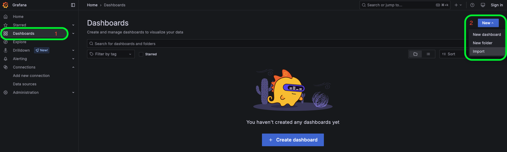
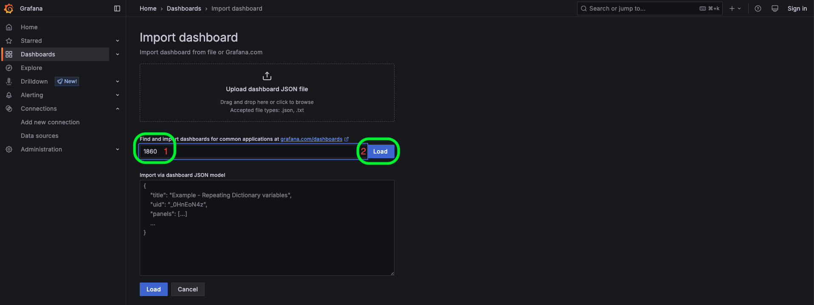
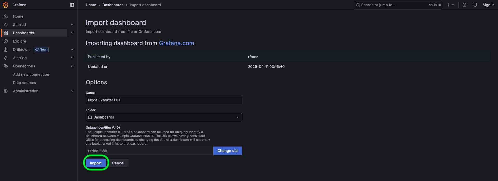
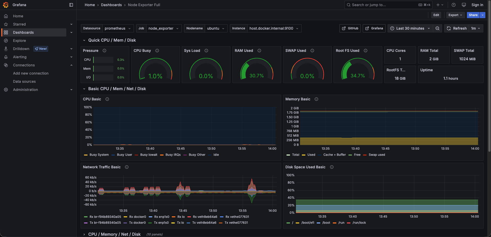

# Paso 4: Importar un dashboard de la comunidad de Grafana

Hasta ahora hemos construido nuestra solución de monitorización paso a paso:

- **Node Exporter** recopila y expone las métricas del servidor Ubuntu.
- **Prometheus** recopila y almacena estas métricas.
- **Grafana** utiliza Prometheus como data source para consultar las métricas.

En este último paso utilizaremos un dashboard creado por la comunidad de Grafana para visualizar las métricas de nuestro servidor Linux.

## 1. Node Exporter Full

Para este escenario utilizaremos el dashboard **Node Exporter Full**, disponible en la comunidad de Grafana.

Este dashboard está diseñado para visualizar las métricas recopiladas por Node Exporter y proporciona diferentes paneles para monitorizar aspectos como CPU, memoria, almacenamiento y red.

Puedes consultar el dashboard en la página oficial de Grafana:

[Node Exporter Full](https://grafana.com/grafana/dashboards/1860-node-exporter-full/)

> **Nota:** Los dashboards de la comunidad de Grafana pueden utilizar diferentes métricas, etiquetas o configuraciones dependiendo de cómo se haya configurado Node Exporter y Prometheus. En este escenario utilizaremos la configuración estándar de Node Exporter.

## 2. Importar el dashboard

Desde la interfaz de Grafana, abre el menú lateral y selecciona:

**Dashboards**

A continuación, selecciona:

**New → Import**



En el campo Import **Find and import dashboard...**, introduce:

```text
1860
```{{copy}}

Haz clic en:

**Load**



Grafana cargará la información del dashboard y mostrará las opciones de configuración.

## 3. Seleccionar el nombre y carpeta del dashboard

Durante el proceso de importación, Grafana solicitará definir el **nombre** y **carpeta** que utilizará el dashboard, podemos dejar los valores por defecto.

Finalmente, haz clic en:

**Import**



Grafana creará el dashboard y nos llevará automáticamente a la vista del dashboard.



## 4. Explorar el dashboard

Una vez importado, deberías poder visualizar diferentes paneles con información sobre nuestro servidor Ubuntu.

Entre las métricas que podemos visualizar se encuentran:

- Uso de CPU.
- Uso de memoria.
- Espacio disponible en disco.
- Actividad de los discos.
- Tráfico de red.
- Carga del sistema.
- Tiempo de actividad del servidor.

El dashboard utiliza las métricas que Prometheus ha recopilado desde Node Exporter para generar estas visualizaciones.

El flujo completo de nuestra solución ahora es:

```text
┌─────────────────┐
│  Ubuntu Linux   │
│                 │
│  Node Exporter  │
└────────┬────────┘
         │
         │ metrics
         ▼
┌─────────────────┐
│    Prometheus   │
│                 │
│  Time Series DB │
└────────┬────────┘
         │
         │ queries
         ▼
┌─────────────────┐
│     Grafana     │
│                 │
│    Dashboard    │
└─────────────────┘
```

## 5. Verificar las métricas

Para comprobar que el dashboard está utilizando correctamente nuestras métricas, puedes interactuar con los diferentes paneles y observar cómo se actualizan los valores.

También puedes regresar a **Explore** y consultar nuevamente métricas de Node Exporter, por ejemplo:

```text
node_cpu_seconds_total
```{{copy}}

o:

```text
node_memory_MemAvailable_bytes
```{{copy}}

Esto te permitirá relacionar las métricas que consultamos anteriormente en Explore con las visualizaciones que aparecen en el dashboard.

# Resumen

En este paso hemos:

- Conocido el dashboard **Node Exporter Full** de la comunidad de Grafana.
- Importado el dashboard utilizando su ID `1860`.
- Seleccionado **Prometheus** como data source.
- Visualizado las métricas de nuestro servidor Ubuntu mediante un dashboard preconstruido.

# ¡Felicitaciones!

Has completado el escenario y construido una solución básica de monitorización utilizando **Node Exporter, Prometheus y Grafana.**

La solución final permite recopilar, almacenar y visualizar las métricas de un servidor Linux:

```text
Node Exporter
      │
      │ scrape
      ▼
 Prometheus
      │
      │ query
      ▼
   Grafana
      │
      ▼
 Dashboard
```

A partir de esta configuración puedes continuar explorando Grafana creando tus propios dashboards, agregando nuevos paneles y utilizando consultas **PromQL** para analizar las métricas de tu servidor.

# ¿Qué puedes aprender a continuación?

Este escenario es solo el punto de partida. Ahora que tienes una base de [Prometheus](https://prometheus.io/) y [Grafana](https://grafana.com/oss/grafana/), puedes continuar explorando temas como:

- Crear tus propios [dashboards](https://grafana.com/docs/grafana/latest/visualizations/dashboards/) y [paneles](https://grafana.com/docs/grafana/latest/visualizations/panels-visualizations/panel-overview/) en Grafana.
- Escribir consultas más avanzadas utilizando [PromQL](https://prometheus.io/docs/prometheus/latest/querying/basics/).
- Configurar [alertas](https://grafana.com/docs/grafana/latest/alerting/) en Grafana.
- Monitorizar aplicaciones y servicios utilizando diferentes [exporters](https://prometheus.io/docs/instrumenting/exporters/).
- Explorar otras [fuentes de datos](https://grafana.com/docs/grafana/latest/datasources/) compatibles con Grafana.
- Utilizar [OpenTelemetry](https://opentelemetry.io/docs/what-is-opentelemetry/) para recopilar métricas, logs y trazas.
- Integrar Grafana y Prometheus en entornos [Kubernetes](https://github.com/prometheus-community/helm-charts/tree/main/charts/kube-prometheus-stack).

La mejor manera de aprender estas herramientas es experimentar, modificar las consultas y observar cómo cambian las visualizaciones.