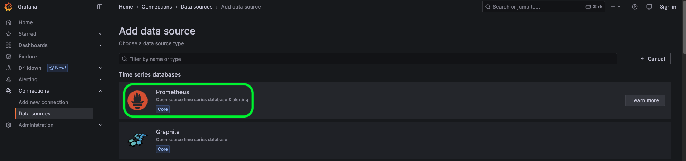
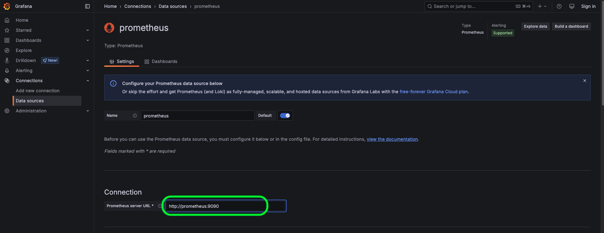
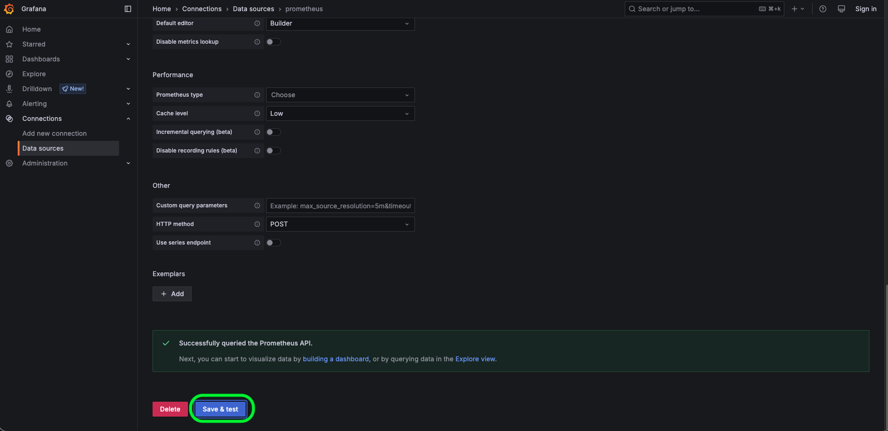
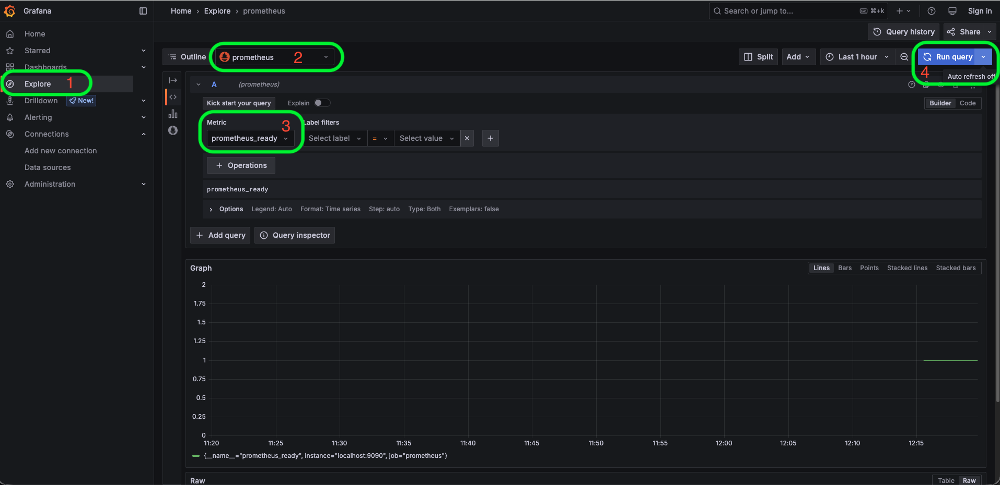
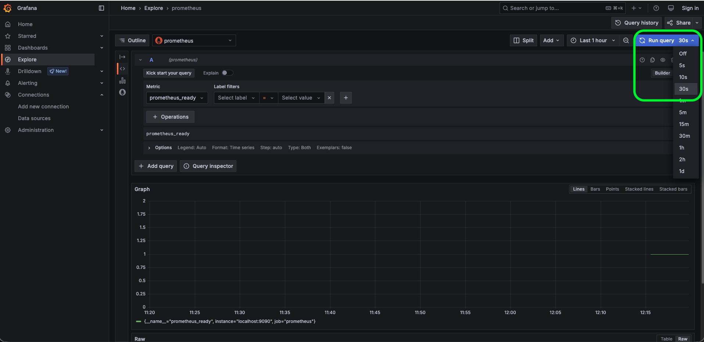

# Paso 3: Instalar y configurar Grafana

En los pasos anteriores instalamos **Node Exporter** y **Prometheus**. Ahora agregaremos **Grafana** a nuestra solución de monitorización.

Grafana será la herramienta que utilizaremos para consultar las métricas almacenadas en Prometheus y visualizarlas mediante gráficos y dashboards.

En este paso nos concentraremos únicamente en instalar Grafana y configurar **Prometheus como data source**. En el siguiente paso utilizaremos este data source para importar un dashboard de la comunidad de Grafana.

## 1. Iniciar Grafana

El servicio de Grafana ya está definido en nuestro archivo `docker-compose.yml`.

Primero, accederemos al directorio del proyecto:

```bash
cd ~/prometheus-grafana-observability
```{{exec}}

Podemos revisar que el servicio `grafana` está definido en el archivo:

```bash
cat docker-compose.yml
```{{exec}}

El servicio utiliza la imagen oficial de Grafana:

```yaml
grafana:
  image: grafana/grafana:11.6
```

Grafana estará disponible en el puerto `3000` del servidor.

Para iniciar Grafana, ejecutaremos:

```bash
docker-compose up -d grafana
```{{exec}}

> **Nota:** Grafana puede tardar unos momentos en iniciar completamente después de ejecutar el comando anterior. **Espera un par de minutos antes de acceder a la interfaz web.** Si intentas acceder inmediatamente, es posible que inicialmente aparezca un error mientras el servidor termina de iniciar.

Podemos comprobar que el contenedor está ejecutándose:

```bash
docker-compose ps
```{{exec}}

Deberías ver los servicios `prometheus` y `grafana` con un estado similar a:

```text
NAME         STATUS
prometheus   Up
grafana      Up
```

## 2. Acceder a Grafana

Grafana está disponible en el puerto `3000`.

Puedes acceder a la interfaz web utilizando el siguiente enlace:

[http://localhost:3000]({{TRAFFIC_HOST1_3000}})

En este escenario no será necesario introducir credenciales para acceder a Grafana. El entorno está configurado para permitir el acceso anónimo con permisos de administrador.

Una vez dentro de Grafana, deberías poder visualizar la página principal de la aplicación.

## 3. ¿Qué es un data source?

Grafana puede obtener información desde diferentes fuentes de datos, como bases de datos, sistemas de monitorización y bases de datos de series temporales.

Estas fuentes de datos se configuran en Grafana como **data sources**.

En nuestro escenario utilizaremos **Prometheus como data source**:

```text
Node Exporter
      │
      │ scrape
      ▼
  Prometheus
      ▲
      │ query
      │
    Grafana
```

Prometheus se encarga de recopilar y almacenar las métricas, mientras que Grafana las consulta y las presenta mediante visualizaciones.

## 4. Agregar Prometheus como data source

Desde la interfaz de Grafana, abre el menú de configuración y selecciona:

**Connections → Data sources**

Haz clic en:

**Add new data source**


Selecciona:

**Prometheus**



Ahora debemos indicar a Grafana dónde puede encontrar nuestro servidor Prometheus.

Como ambos servicios se ejecutan dentro del mismo entorno Docker Compose, podemos utilizar el nombre del servicio `prometheus` como hostname.

En el campo **Prometheus server URL**, introduce:

```text
http://prometheus:9090
```{{copy}}

La configuración debería quedar similar a:

```text
Prometheus server URL: http://prometheus:9090
```



> **Importante:** Aquí no utilizamos `localhost:9090`. Desde el contenedor de Grafana, `localhost` hace referencia al propio contenedor de Grafana. Utilizamos `prometheus` porque corresponde al nombre del servicio definido en Docker Compose y Docker permite que los servicios se comuniquen utilizando sus nombres.

No es necesario modificar las demás opciones para este escenario.

Haz clic en:

**Save & test**


## 5. Verificar la conexión

Si la configuración es correcta, Grafana debería mostrar un mensaje indicando que el data source está funcionando correctamente.

Esto confirma que Grafana puede comunicarse con Prometheus utilizando:

```text
Grafana → http://prometheus:9090 → Prometheus
```

Ahora Grafana está preparado para consultar las métricas recopiladas por Prometheus.
### 5.1. Consultar una métrica desde Grafana Explore

Ahora que hemos configurado Prometheus como data source, podemos comprobar que Grafana es capaz de consultar las métricas almacenadas en Prometheus.

Para ello utilizaremos **Explore**, una herramienta de Grafana que permite consultar y analizar datos directamente desde un data source.

Desde el menú lateral de Grafana, selecciona:

**Explore**

En la parte superior de la pantalla, selecciona el data source:

**Prometheus**

A continuación, introduce la siguiente métrica en el editor de consultas:

```text
prometheus_ready
```{{copy}}

Esta métrica nos permite comprobar que Prometheus está listo para procesar consultas.

Ejecuta la consulta haciendo clic en Run query.

Deberías obtener un resultado con un valor de:

```text
1
```

Esto indica que Prometheus está listo y que Grafana puede consultar correctamente sus métricas.


### 5.2 (Opcional) Configurar el refresco automático

También podemos configurar Grafana para que vuelva a ejecutar la consulta automáticamente.

En la opción **Auto refresh**, selecciona:

```text
30s
```


De esta manera, Grafana ejecutará nuevamente la consulta cada 30 segundos y actualizará el resultado.

La configuración debería quedar similar a:

```text
Data source:   Prometheus
Query:         prometheus_ready
Refresh query: 30s
```

Si la consulta devuelve `1`, habremos comprobado que la comunicación entre Grafana y Prometheus funciona correctamente:

```text
Grafana Explore
      │
      │ query: prometheus_ready
      ▼
  Prometheus
      │
      │ result: 1
      ▼
    Grafana
```

> **Nota:** Esta comprobación es diferente a utilizar **Save & test** en la configuración del data source. `Save & test` comprueba que Grafana puede comunicarse con Prometheus, mientras que esta consulta nos permite verificar que Grafana puede consultar datos desde Prometheus.

## Resumen

En este paso hemos:

* Iniciado **Grafana** utilizando Docker Compose.
* Accedido a la interfaz web de Grafana.
* Aprendido qué es un **data source**.
* Configurado **Prometheus como data source** en Grafana.
* Verificado que Grafana puede comunicarse correctamente con Prometheus.

Nuestra arquitectura ahora tiene el flujo completo desde la recopilación hasta la visualización:

```text
                         scrape
Prometheus ─────────────────────────> Node Exporter
     ▲                                      │
     │                                      │
     │ query                                │
     │                                      ▼
   Grafana                            Ubuntu Linux
     ▲
     │
     │
Web Browser
```

En el siguiente paso utilizaremos el data source de Prometheus para **importar un dashboard de la comunidad de Grafana** y visualizar las métricas de nuestro servidor Linux.
